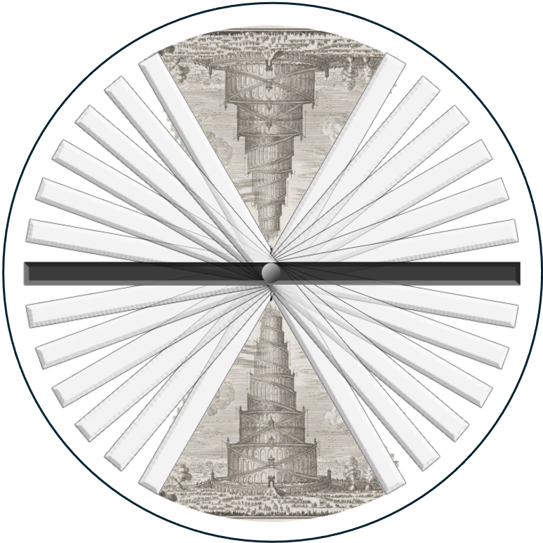

===============
TomoBabel
===============

TomoBabel  is designed to facilitate transfer and reuse of cryo-electron tomography
(cryoET) data through a standardized data format (SDF).  The library and command line programs
convert data from cryoET data processing software to the SDF and from the SDF to various
software formats, allowing interoperability between different packages.

The SDF will be adopted by both the `CZII CryoET DataPortal <https://cryoetdataportal.czscience.com/>`_
and `Electron Microscopy Public Image Archive (EMPIAR) <https://www.ebi.ac.uk/empiar/>`_.

To install:

.. code-block::

 git clone https://github.com/TomoBabel/TomoBabel.git
 cd TomoBabel
 pip install .
