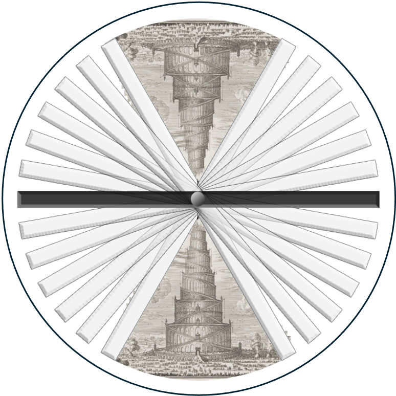

.. TomoBabel documentation master file, created by
   sphinx-quickstart on Tue Jul  6 13:40:49 2021.
   You can adapt this file completely to your liking, but it should at least
   contain the root `toctree` directive.

===============
TomoBabel
===============

TomoBabel  is designed to facilitate transfer and reuse of cryo-electron tomography
(cryoET) data through a standardized data format (SDF).  The library and command line programs
convert data from cryoET data processing software to the SDF and from the SDF to various
software formats, allowing interoperability between different packages.

The SDF will be adopted by both the `CZII CryoET DataPortal <https://cryoetdataportal.czscience.com/>`_
and `Electron Microscopy Public Image Archive (EMPIAR) <https://www.ebi.ac.uk/empiar/>`_.

General info and installation
-----------------------------

.. toctree::
   :maxdepth: 1

   README <source/readme_link>

Converters - current
--------------------

.. toctree::
   :maxdepth: 1

   source/converters/relion/cmd_relion

Converters - planned
--------------------

.. toctree::
   :maxdepth: 1

   source/converters/cmd_dynamo

.. toctree::
   :maxdepth: 1

   source/converters/cmd_eman2

.. toctree::
   :maxdepth: 1

   source/converters/cmd_scipion

.. toctree::
   :maxdepth: 1

   source/converters/cmd_warpm

The Standardised Data Model
---------------------------

.. toctree::
   :maxdepth: 1

   source/data_objs

.. toctree::
   :maxdepth: 1

   source/geometry

For developers
--------------

.. toctree::
   :maxdepth: 1

   source/dev/setup

.. toctree::
   :maxdepth: 1

   source/dev/writing_converters

.. toctree::
   :maxdepth: 1

   source/dev/dev_data_model

Indices and tables
==================

* :ref:`genindex`
* :ref:`modindex`
* :ref:`search`
